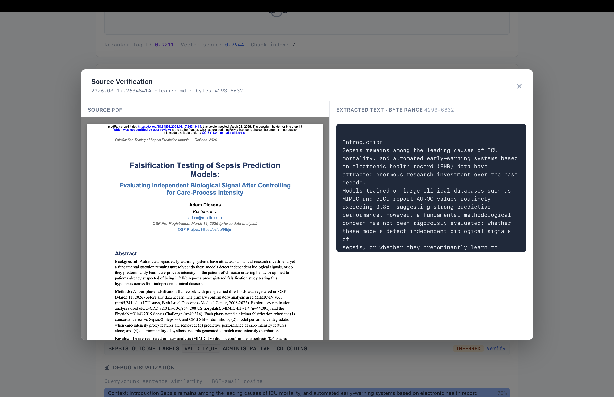

# Healthcare Platform

**Local-first, open‑source clinical trial matching.**
No API keys. No cloud. Just `git clone` + `docker-compose up`.

[](https://opensource.org/licenses/MIT)
[](https://python.org)
[](https://docker.com)

---



## Quickstart (5 minutes)

```bash
git clone https://github.com/ronit22203/healthcare-platform
cd healthcare-platform
make bootstrap          # checks dependencies + creates .env.local
make up                 # starts Neo4j, Qdrant
make fetch MAX_PDFS=5   # downloads sample PDFs
make ingest             # OCR → chunk → embed → graph
make reasoning-run-query QUERY="What biomarkers predict sepsis mortality?"
```

---

## Architecture (4 modules)

| Module | What it does |
|--------|--------------|
| `data-acquisition` | Fetches PDFs from medRxiv, PubMed, ClinicalTrials |
| `data-ingestion` | OCR (Surya) → PII redaction → chunking → Qdrant + Neo4j |
| `agentic-reasoning` | LangGraph + Ollama LLM, parallel tool execution |
| `platform-ui` | Next.js 14 dashboard for clinicians |

---

## Services

| Service | URL | Credentials |
|---------|-----|-------------|
| Neo4j Browser | <http://localhost:7474> | `neo4j` / `testpassword` |
| Qdrant Dashboard | <http://localhost:6333/dashboard> | – |
| Reasoning API | <http://localhost:8000> | – |
| UI Dev Server | <http://localhost:3000> | – |

---

## Make targets

All `make` commands now live in the **repo root**. For module-level control, use the namespaced targets: `reasoning-*`, `acquisition-*`, and `ingestion-*`.

```bash
make up                         # start shared Docker services
make fetch MAX_PDFS=5           # download PDFs
make ingestion-run N=5          # run the ingestion pipeline directly
make reasoning-run-query QUERY="..."  # one-shot reasoning query
make reasoning-serve-api        # start the FastAPI backend
make serve-ui                   # start the Next.js frontend
make help                       # list the full root control surface
```

---

## Configuration

- **`config/app.yaml`** – the single non-secret source of truth for ingestion, acquisition, and agent/tool config
- **`.env.local`** – ports, URLs, secrets (gitignored; copy from `.env.local.example`)

Change any setting → rerun `make ingest` – deterministic rebuild.

---

## Prerequisites

- [Docker Desktop](https://docker.com) (Compose v2)
- [Ollama](https://ollama.ai) (`brew install ollama`)
- Python 3.11+ + Node.js 18+

### Required Ollama models

```bash
ollama pull qwen3:8b          # reasoning (~5 GB)
ollama pull nomic-embed-text  # embeddings (~274 MB)
ollama pull cniongolo/biomistral:latest # biomistral (~2.5 GB)
```

---

## Troubleshooting (common)

**Port conflict?**
`lsof -i :7474` (Neo4j) / `:6333` (Qdrant) / `:8000` (API) / `:3000` (UI)

**Neo4j password mismatch?**
`docker compose -f docker-compose.local.yml down -v && make up`

**Ollama not responding?**
`ollama serve` (in a separate terminal)

**UI shows mock data?**
Set `NEXT_PUBLIC_USE_MOCK=false` in `platform-ui/.env.local` and ensure API is running (`make serve-api`).

---

## Data layout

```
data/
├── pdfs/          # raw PDFs (input)
├── artifacts/     # ocr/, markdown/, cleaned/, chunks/
├── neo4j/         # graph DB
└── qdrant/        # vector DB
```

---

## Built with

- **Surya OCR** (MPS/CPU)
- **Qdrant** (vector search)
- **Neo4j** (graph reasoning)
- **Ollama** (local LLM)
- **LangGraph** (agentic workflows)

---

# Issues

Infrastructure is heavy (multiple Docker services) → consider lightweight alternatives for local dev.

It is big and slow

Might be overkill for simple use cases → modular design allows swapping components, currently focusing on simplification and product reliability. Collaboration welcome

## License

MIT – use it, break it, improve it.

---

**Questions?** Open an issue or reach out.
`CHPA®` · `AI-102` · `DP-100` – compliant by design.
