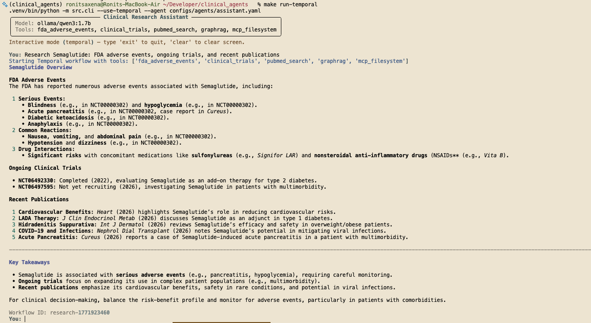
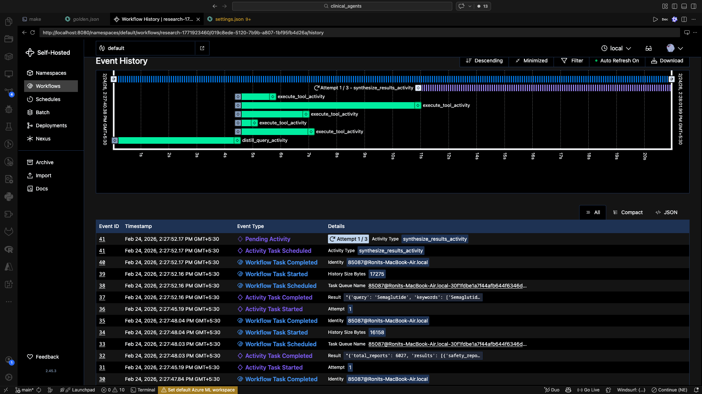

# Clinical Agents


A configuration first platform for building production clinical research AI. Agent behavior, tool selection, model parameters, and workflow routing are defined entirely in YAML — *no source code changes required.*

> **Makefile topology changed:** run all `make` commands from the **repo root**. Use `make reasoning-*` targets such as `make reasoning-install`, `make reasoning-run-query QUERY="..."`, and `make reasoning-temporal-up`.

---

## Quick Start

**System dependencies** (install before anything else):

| Dependency | Purpose | Install |
|---|---|---|
| Python 3.12+ | Runtime | [python.org](https://www.python.org/downloads/) or `brew install python@3.12` |
| Docker + Docker Compose | Temporal infrastructure, Qdrant, Neo4j | [docker.com](https://www.docker.com/products/docker-desktop/) |
| Ollama | Local LLM inference | [ollama.com](https://ollama.com) or `brew install ollama` |
| Make | Task runner | pre-installed on macOS/Linux; `choco install make` on Windows |

```bash
# 1. Pull a local model
ollama pull qwen3:1.7b

# 2. Clone and install
git clone https://github.com/your-org/clinical-agents.git
cd clinical-agents
make reasoning-install

# 3. Configure environment
cp .env.example .env   # add API keys if using external tools

# 4. Run a query (no infrastructure required)
make reasoning-run-query QUERY="Find Phase 3 clinical trials for lung cancer immunotherapy"
```

For durable, auditable workflows with Temporal:

```bash
make reasoning-temporal-up      # Terminal 1 — start infrastructure (UI at http://localhost:8080)
make reasoning-temporal-worker  # Terminal 2 — start activity worker
make reasoning-temporal-run QUERY="Research Semaglutide: FDA adverse events, ongoing trials, and recent publications"  # Terminal 3
```

---

## What Makes This Different

Most AI agent frameworks require developers to write orchestration logic in Python. Clinical Agents inverts that relationship: **YAML is policy, Python is infrastructure.** The execution engine is stable; every behavioral decision lives in configuration files that can be reviewed, versioned, and changed by non engineers.

The platform ships with two execution runtimes that operate from the same configuration:

- **LangGraph ReAct** — synchronous, low latency, autonomous tool selection. The LLM decides which tools to call and in what order based on the query.
- **Temporal Workflows** — durable, retryable, parallel execution with a complete audit trail and an optional human-in-the-loop approval gate. The appropriate choice for production workloads, regulatory environments, and any scenario requiring a verifiable record of each reasoning step.


> Both runtimes consume identical agent and tool YAML files. Switching between them is a single CLI flag.

---

## Architecture

```
┌─────────────────────────────────────────────────────────────────┐
│                        YAML Configuration                        │
│         config/app.yaml → agentic_reasoning.agents / agentic_reasoning.tools                       │
└───────────────────────────────┬─────────────────────────────────┘
                                │  Pydantic validation
                                ▼
┌─────────────────────────────────────────────────────────────────┐
│                          Core Engine                             │
│   ConfigLoader → ToolRegistry → SimpleAgent → ExecutionLogger   │
└────────────┬───────────────────────────┬────────────────────────┘
             │                           │
             ▼                           ▼
  ┌──────────────────┐        ┌──────────────────────────────┐
  │  LangGraph ReAct │        │     Temporal Workflow         │
  │  (interactive,   │        │  distill_query_activity       │
  │   low latency)   │        │  execute_tool_activity × N    │
  │                  │        │    (parallel, retried)        │
  │  Autonomous tool │        │  synthesize_results_activity  │
  │  selection via   │        │  [optional HITL gate]         │
  │  LLM reasoning   │        └──────────────────────────────┘
  └──────────────────┘
             │                           │
             └─────────────┬─────────────┘
                           ▼
              ┌────────────────────────┐
              │     Tool Registry      │
              │  PubMed  │  openFDA    │
              │  ClinTrials │ GraphRAG │
              │  MCP Filesystem        │
              └────────────────────────┘
                           │
                           ▼
              ┌────────────────────────┐
              │    ExecutionLogger     │
              │  log/{id}.json         │
              │  log/summary.jsonl     │
              └────────────────────────┘
```

### Architectural Principles

**Configuration-first.** Swapping models, enabling or disabling tools, adjusting temperature, or changing system prompts requires editing a YAML file — not deploying code. This separates the concerns of the engineering team (maintaining the engine) from those of clinical and product teams (defining agent behavior).

**Dual runtime, single config.** The same agent YAML drives both the synchronous ReAct agent and the durable Temporal workflow. There is no separate workflow definition language to learn.

**Lazy loading and fault isolation.** Tools are loaded only when referenced by an agent config. A tool that fails to load (invalid YAML, missing dependency) does not prevent the remaining tools from loading. Temporal activities retry independently; a single failing data source does not abort the entire workflow.

**Plugin tool architecture.** Every tool inherits from `BaseTool` and implements a single `execute()` method. The registry discovers and instantiates tools at runtime from YAML configuration. Adding a new data source — a custom EHR connector, an internal knowledge base, a proprietary API — requires creating one Python file and one YAML file. Nothing else changes.

**GraphRAG knowledge elevation.** When an internal knowledge base (Qdrant vector search + Neo4j graph enrichment) is configured alongside external APIs, the synthesis prompt explicitly instructs the LLM to treat internal results as primary evidence. This prevents curated proprietary knowledge from being outweighed by public databases.

**Human-in-the-loop as a first-class primitive.** The Temporal workflow includes a configurable approval gate. After all tool activities complete and raw results are collected, execution pauses and waits for an operator signal before invoking the LLM for synthesis. Gate timeout, display logic, and the approval mechanism are all configurable without touching workflow code.

---

## Tech Stack

| Layer | Technology |
|---|---|
| Language | Python 3.12+ |
| Agent framework | LangChain + LangGraph |
| Durable orchestration | Temporal.io |
| Vector database | Qdrant |
| Graph database | Neo4j |
| Embeddings | BAAI/bge-small-en-v1.5 (local), extensible |
| LLMs | Ollama (local), LiteLLM (any provider) |
| Configuration validation | Pydantic v2 + YAML |
| MCP integration | Model Context Protocol (stdio/SSE) |
| Infrastructure | Docker Compose (local), extensible to cloud |

---

## Getting Started

### Prerequisites

- Python 3.12+
- Docker and Docker Compose
- [Ollama](https://ollama.com) with a local model (e.g., `ollama pull qwen3:1.7b`)

### Installation

```bash
git clone https://github.com/your-org/clinical-agents.git
cd clinical-agents
make reasoning-install
cp .env.example .env   # add API keys
```

### Run interactively

```bash
make reasoning-run
```

### Run a single query

```bash
make reasoning-run-query QUERY="Find Phase 3 clinical trials for lung cancer immunotherapy"
```

### Run with Temporal (durable, parallel, auditable)

```bash
# Terminal 1: start infrastructure (Temporal UI at http://localhost:8080)
make reasoning-temporal-up

# Terminal 2: start the activity worker
make reasoning-temporal-worker

# Terminal 3: run a query
make reasoning-temporal-run QUERY="Research Semaglutide: FDA adverse events, ongoing trials, and recent publications"
```

### Run with human-in-the-loop approval

```bash
make reasoning-temporal-run-hitl QUERY="For a diabetic patient with hypertension, what's the optimal aspirin regimen? Use our knowledge graph for contraindications, FDA for safety, and trials for evidence."
```

The workflow pauses after collecting tool results. The operator reviews raw data and signals approval before the LLM synthesizes a final answer.

---

## Project Structure

```
clinical-agents/
├── configs/
│   ├── agents/          # Agent YAML definitions (model, tools, system prompt)
│   └── tools/           # Tool YAML definitions (module, class, config, auth)
├── src/
│   ├── agent.py         # SimpleAgent: LangGraph ReAct + direct LLM modes
│   ├── cli.py           # Click CLI, --use-temporal, --human-in-loop flags
│   ├── config_loader.py # Pydantic-validated YAML loader
│   ├── logging_handler.py
│   ├── tools/
│   │   ├── base.py      # BaseTool abstract class (TTL cache, connection pool)
│   │   ├── registry.py  # Dynamic tool loader
│   │   └── implementations/
│   │       ├── pubmed.py
│   │       ├── openfda.py
│   │       ├── clinicaltrials.py
│   │       ├── graphrag_tools.py
│   │       └── mcp_tool.py
│   └── temporal/
│       ├── workflows.py  # ClinicalResearchWorkflow (deterministic)
│       ├── activities.py # distill_query, execute_tool, synthesize_results
│       ├── worker.py
│       └── client.py
├── infra/               # Docker Compose (Temporal, Qdrant, Neo4j)
├── tests/
├── docs/                # Component-level technical documentation
└── Makefile
```

---

## Configuration

### Agent definition

```yaml
# config/app.yaml → agentic_reasoning.agents.assistant
name: "Clinical Research Assistant"
model: ollama/qwen3:1.7b
system_prompt: |
  You are a clinical research assistant. Answer with precision.
  Cite sources. Flag uncertainty explicitly.
model_params:
  temperature: 0.1
  max_tokens: 2048
tools:
  - name: pubmed_search
  - name: fda_adverse_events
  - name: clinical_trials
```

### Tool definition

```yaml
# config/app.yaml → agentic_reasoning.tools.fda_adverse_events
name: fda_adverse_events
description: Query the FDA adverse event database by drug name.
type: api
module: src.tools.implementations.openfda
class_name: OpenFDATool
config:
  base_url: "https://api.fda.gov"
  limit: 5
auth:
  type: api_key
  key: OPENFDA_API_KEY
```

No code changes are required to swap models, add tools, or change agent behavior. All configuration is validated against Pydantic schemas at load time; misconfigured YAML produces field-level error messages before any execution begins.

---

## Built-in Data Sources

| Tool | Source | Notes |
|---|---|---|
| `pubmed_search` | NCBI PubMed eUtils API | Accepts natural-language queries |
| `fda_adverse_events` | openFDA drug/event API | Regex-based drug name extraction |
| `clinical_trials` | ClinicalTrials.gov v2 API | Full-text search across study fields |
| `graphrag_search` | Qdrant + Neo4j | Hybrid vector + knowledge graph retrieval |
| `mcp_filesystem` | MCP filesystem server | File read/write via Model Context Protocol |

---

## Execution Logging

Every query — regardless of runtime path — produces a structured JSON log entry:

```json
{
  "execution_id": "...",
  "model": "ollama/qwen3:1.7b",
  "latency_ms": 4210,
  "tools_called": ["pubmed_search", "fda_adverse_events"],
  "tokens_input": 312,
  "tokens_output": 847,
  "git_commit": "a3f91bc",
  "router_intent": "temporal"
}
```

Logs are written to `log/{execution_id}.json` and appended to `log/summary.jsonl` for downstream analysis.

---

## Documentation

Detailed component documentation is in [`docs/`](docs/):

| Document | Contents |
|---|---|
| [architecture.md](docs/architecture.md) | Full system architecture, data flows, design patterns |
| [agent_system.md](docs/agent_system.md) | SimpleAgent, ExecutionMetrics, ReAct vs direct mode |
| [temporal_system.md](docs/temporal_system.md) | Workflow, activities, HITL gate, worker setup |
| [tool_system.md](docs/tool_system.md) | BaseTool, ToolRegistry, built-in implementations |
| [config_system.md](docs/config_system.md) | Agent and tool config schemas, validation |
| [cli_interface.md](docs/cli_interface.md) | CLI flags, interactive mode, streaming |
| [logging_system.md](docs/logging_system.md) | Log schema, audit trail, JSONL format |
| [mcp_system.md](docs/mcp_system.md) | Model Context Protocol integration |

---

## Workflow Execution Example

Below is an example of a Temporal workflow execution:



---

## Query Results Example

Below is an example of query results from the system:



---

## License

MIT License — see [LICENSE](LICENSE) for details.
