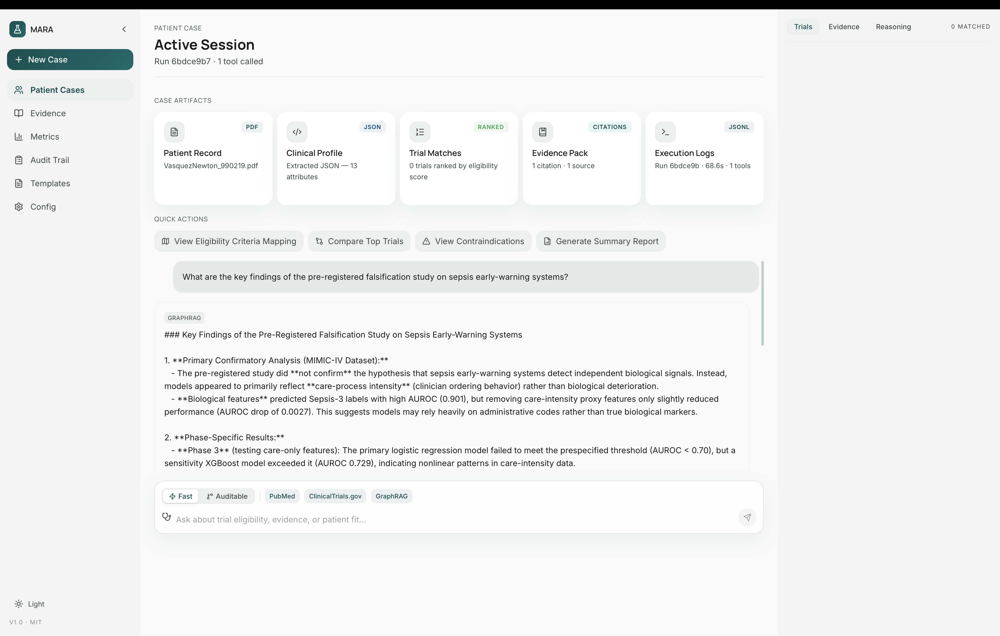

# Documentation



## Guides

| Document | Description |
|----------|-------------|
| [Quickstart](quickstart.md) | Prerequisites, installation, and first run (macOS / local dev) |
| [Production Startup](prod-startup.md) | Ubuntu 22.04 + NVIDIA L4 — SGLang, native Neo4j/Qdrant, no Docker |
| [Spot Instance Postmortem](spot-instance-postmortem.md) | Where production startup on a spot instance succeeded, stalled, and why the instance was terminated |
| [Architecture](architecture.md) | System design, module topology, data flow |
| [Data Pipeline](data-pipeline.md) | Six-stage ingestion pipeline reference |
| [Agent Framework](agent-framework.md) | LangGraph ReAct runtime and tool plugin system |

## Reference

| Document | Description |
|----------|-------------|
| [Configuration](configuration.md) | `config/app.yaml` field-by-field reference |
| [API Reference](api-reference.md) | FastAPI endpoint schemas and examples |
| [Backend Endpoints](backend-endpoints.md) | Query & Retrieval + Ingestion Pipeline endpoint specs, TypeScript types, SSE events |
| [Make Reference](make-reference.md) | All `make` targets organised by module |

## Module Overview

```
agentic-reasoning/   LangGraph ReAct + concurrent tool execution
data-acquisition/    Multi-source PDF fetcher (medRxiv, bioRxiv, PubMed, ClinicalTrials.gov)
data-ingestion/      PDF → OCR → Markdown → Clean → Chunk → Embed (Qdrant + Neo4j)
platform-ui/         Next.js 16 App Router frontend
config/              config/app.yaml — single source of truth for all behaviour
```
